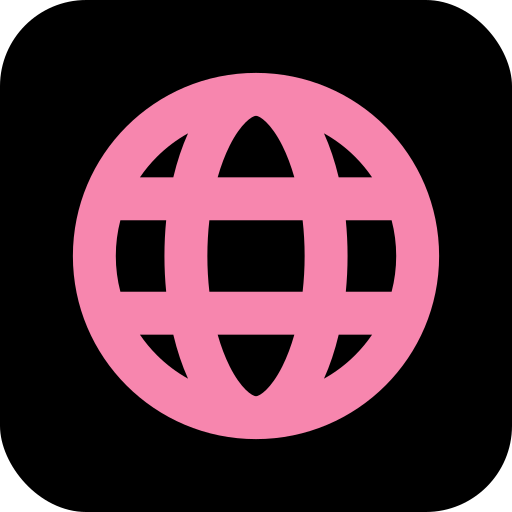

<h3 align="center"> Hewo, I'm Laith - aka <a href="https://iconical.dev">Iconical</a> 👋 </h3>
<h2 align="center"> 

</h2>

 
 

  
  
    
### 🔥 What I’m working on:  
- Constantly **improving my stack**—from game to full-stack development.  
- Developing games in Unreal Engine and web aoos with Next.js.  
- Building **OopsApps**, a suite of self-hosted web apps for smarter workflows.  

### 🥅 2025-2026 Goals:  
- Contribute more to open-source and community-driven development.  
- Keep pushing my skills in both game and web development.  
- Finalize and launch my side projects.  

### 🎨 What I create:  
- **Games** (Unreal Engine, Godot)  
- **Web Apps** (Next.js, TypeScript, full-stack systems)  
- **Automation & Tools** (Discord bots, AI-powered features)  

### ☕ Support my madness: 
 - If you enjoy my work, find it useful, or just want to fuel my late-night coding sprees, [Buy me a coffee](https://www.buymeacoffee.com/iconical) and keep the madness alive!  

    

  

   

  <h2 style="font-size: 1.5rem">Connect with me 💟</h2>

  
  
  
  
  

  
 

      

 

  <h2 style="font-size: 1.5rem" >My Skills 😇</h2>

<table>
<tr>
<td valign="top" width="33%">
<h2>💻 Development</h2>  

  
    
   
    
    
    
    
    
    
    
    
   
    
    
   
  

 
</td>
  
<td valign="top" width="33%">
<h2>🛠️ Apps & Engines</h2>  

  
    
    
    
    
    
    

  
</td>

<td valign="top" width="33%">
<h2>☁️ Services</h2>    

  
    
    
    
    

  
</td>

</tr>
</table>   

---
 

  <h2 style="font-size: 1.5rem" >My Stats 📊</h2>

 

🧮 Check Statistics

 

 

  

  
  

    
  
  
  

---

 

  
🧠 Check Activities

    
     
  

   

  
  
  
  

 

  
---

### 📑 Recent Blog Posts
<!-- BLOG-POST-LIST:START -->
- [Synology Install XBackBone With Portainer](https://iconical.dev/blog/Synology-Install-XBackBone-With-Portainer)
- [Exploring Deno 2.0 Why Developers Should Care](https://iconical.dev/blog/Exploring-Deno-2.0)
- [The Best of 2024 Browsers Edition](https://iconical.dev/blog/The-Best-of-2024-Browsers-Edition)
- [Resources to learn Rust](https://iconical.dev/blog/Resources-to-learn-Rust)
- [Introduction to Testing in JavaScript](https://iconical.dev/blog/Introduction-To-Testing-In-JavaScript)
<!-- BLOG-POST-LIST:END -->

---
  
<h4 align="center">
   <a href="https://iconical.dev/">©Iconical</a></h4>
